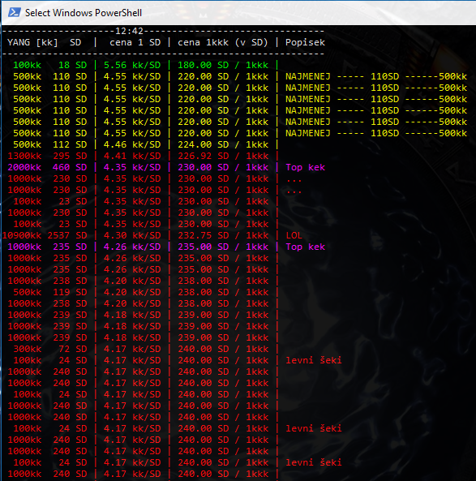

## BLACKMARKET 
Tento jednoduchy program stahne pomoci SSID nektereho z existujicich uctu data (html) z webove stranky blackmarketu, ze kterych vyfiltruje kyzena data, seradi je, spocita cenove pomery a barevne je vypise do terminalu

Program bezi nejlepe pres Python3.6 ve Windows, idealne pres Powershell.

